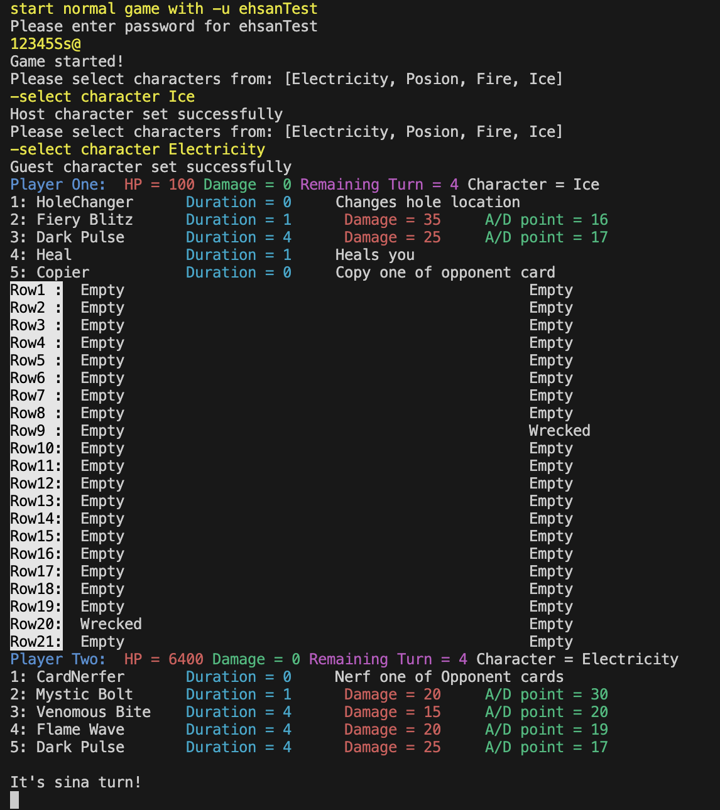
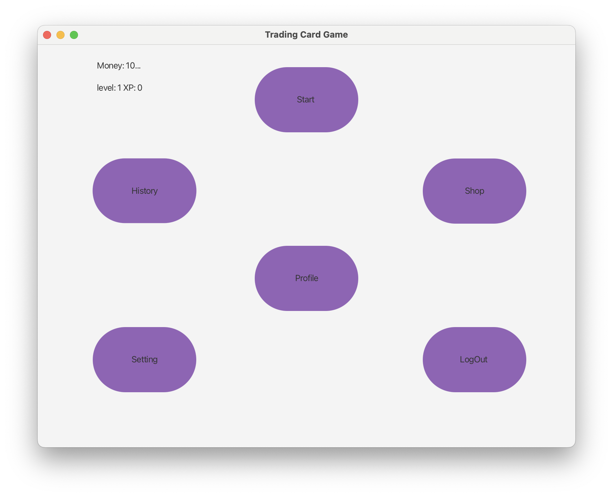

# Trading Card Game

A turn-based trading card game inspired by [CITY WARS: TOKYO REIGN](https://store.steampowered.com/app/1689090/CITY_WARS_TOKYO_REIGN/).

This project is divided into two phases:

## Phase 1: Console Version (Completed) {#phase-1}

<div style="text-align: center;">
   
   
</div>

In this phase, we implemented the game in the console using the MVC (Model, View, Controller) programming pattern. The game features 7 menus:

1. Login/Register Menu - For account registration and login
2. Main Menu - To access other menus
3. Shop Menu - To buy and upgrade cards
4. Game History Menu - To view past games
5. Profile Menu - To see your status and change user settings
6. Game Menu - For gameplay
7. Admin Menu - To configure cards and users

We used MySQL for data storage, with 3 tables for users, cards, and game records.

## Phase 2: Graphical Version (In Progress) {#phase-2}

<div style="text-align: center;">
   
   
   
</div>

In this phase, we're implementing a graphical interface using JavaFX and FXML. The `interactor` folder contains code related to FXML files for each menu, replacing the `view` folder from phase 1. This phase includes 11 menus:

1. Start Menu - To choose between Register and Login
2. SignUp Menu - For account registration
3. Login Menu - For logging in
4. Main Menu - To access other menus
5. Game History Menu - To view past games
6. Profile Menu - To see your status and change user settings
7. Bet Menu - To choose bet value and login for the second player
8. Character Menu - To select game characters
9. Game Menu - For gameplay
10. End Game Menu - To show results and return to the main menu
11. Setting Menu - To change game settings
12. Shop Menu (Incomplete) - To buy and upgrade cards
13. Admin Menu (Incomplete) - To configure cards and users

## Requirements

- Java 17 or higher
- Maven (for dependency management and building)

All other dependencies will be managed by Maven.

## Installation

1. Clone the repository:
   ```
   git clone https://github.com/Sina-Hashemi/trading-card-game.git
   cd trading-card-game
   ```

2. Build the project using Maven:
   ```
   mvn clean install
   ```

## Running the Game

You can run the game using Maven or by opening the project in an IDE like VSCode or IntelliJ IDEA.

### Using Maven

After building the project, run:

```
mvn clean javafx:run
```

### Using an IDE

1. Open the project in your preferred IDE (VSCode, IntelliJ IDEA, etc.)
2. Locate the main class file
3. Run the main class file using the IDE's run functionality

## Contributing

We welcome contributions! Feel free to fork this project and submit pull requests with improvements or bug fixes.

## Authors

- Sina Hashemi
- Ehsan Arab Khaburi
